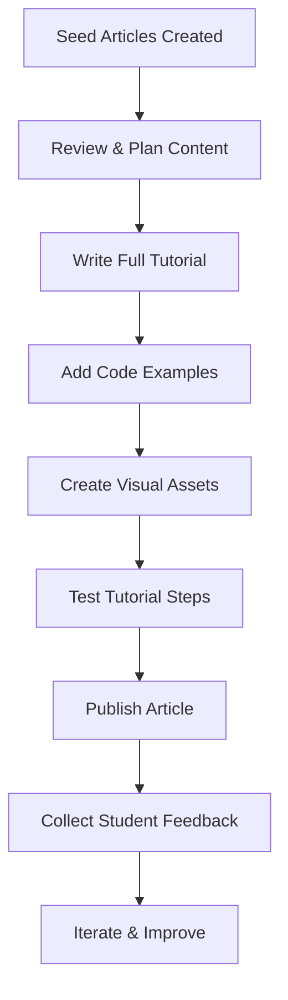

# 📚 Tutorial Articles Seed Documentation

## 🎯 Overview

Dokumentasi ini menjelaskan sistem seeding artikel tutorial yang telah dibuat berdasarkan roadmap pembelajaran classroom GEMA. Artikel-artikel ini dirancang dengan gaya **playful dan joyful** untuk menarik perhatian siswa dan membuat pembelajaran menjadi lebih menyenangkan.

## 🚀 Quick Start

### 1. Menjalankan Seed Tutorial Articles

```bash
# Menggunakan npm script (recommended)
npm run db:seed-tutorials

# Atau langsung menggunakan tsx
npx tsx prisma/seed-tutorial-articles.ts

# Atau menggunakan bash script (Linux/Mac)
bash seed-tutorial-articles.sh
```

### 2. Melihat Hasil di Database

```bash
# Membuka Prisma Studio
npx prisma studio
```

## 📋 Struktur Artikel Tutorial

### 📊 Database Schema

```prisma
model Article {
  id          String    @id @default(cuid())
  title       String    // Judul artikel yang catchy dengan emoji
  slug        String    @unique // URL-friendly slug
  excerpt     String?   // Ringkasan singkat 1-2 kalimat
  content     String    // Konten lengkap (HTML)
  category    String    // "tutorial", "news", "technology", etc.
  tags        String?   // JSON array tags
  author      String    // Nama author
  authorId    String    // Reference ke admin
  status      String    @default("draft") // draft, published, archived
  featured    Boolean   @default(false)
  imageUrl    String?   // Featured image
  readTime    Int?      // Estimasi waktu baca (menit)
  views       Int       @default(0)
  publishedAt DateTime?
  createdAt   DateTime  @default(now())
  updatedAt   DateTime  @updatedAt
}
```

### 🎨 Format Artikel

```typescript
{
  title: "🎨 Bikin Kartu Ucapan Digital yang Bikin Hati Berbunga!",
  slug: "tutorial-kartu-ucapan-interaktif-html-css", 
  excerpt: "Yuk belajar bikin kartu ucapan digital yang cantik dengan HTML, CSS, dan JavaScript! Dijamin teman-teman bakal kagum sama kreasi kamu. 💖",
  category: "tutorial",
  tags: '["HTML", "CSS", "JavaScript", "DOM", "Beginner Friendly"]',
  featured: true,
  readTime: 15,
  status: "draft" // Akan diubah ke "published" setelah konten lengkap
}
```

## 🗺️ Mapping Roadmap ke Artikel

### Project-Article Relationship

| Project | Artikel Utama | Artikel Pendukung |
|---------|---------------|-------------------|
| 🎨 Kartu Ucapan Interaktif | Bikin Kartu Ucapan Digital | Rahasia CSS yang Kece |
| 📸 Galeri Foto Responsif | Galeri Foto Responsif | Filter Data JavaScript |
| 🎮 Game Tebak Angka | Bikin Game Tebak Angka | Logika Pemrograman |
| 🛒 Daftar Belanja | To-Do List Canggih | LocalStorage Gudang Rahasia |
| 🗓️ Planner Jadwal | Planner Digital Produktif | JavaScript Date Object |
| 🎵 Playlist Musik | Playlist Musik Digital | Search Function Kilat |
| 💡 Website Tips | Website Tips Interaktif | Dark Mode Toggle |
| 🍽️ Aplikasi Resep | Aplikasi Resep Masak | Fetch API Internet |
| 📈 Dashboard Statistik | Dashboard Data Visualization | Chart.js Grafik Menawan |
| 🤝 Platform Volunteering | Platform Mengubah Dunia | Integrasi Peta Lokasi |

## 🎯 Karakteristik Penulisan

### ✨ Gaya Bahasa

1. **Playful & Joyful**
   - Menggunakan emoji yang relevan dan menarik
   - Bahasa yang ceria dan mengundang antusiasme
   - Tone yang friendly dan approachable

2. **Student-Friendly**
   - Menghindari jargon teknis yang rumit
   - Menggunakan analogi dan contoh yang relatable
   - Struktur kalimat yang simple dan jelas

3. **Engaging Headlines**
   ```
   ❌ Buruk: "Tutorial HTML dan CSS Dasar"
   ✅ Bagus: "🎨 Bikin Kartu Ucapan Digital yang Bikin Hati Berbunga!"
   
   ❌ Buruk: "Menggunakan CSS Grid untuk Layout"
   ✅ Bagus: "📸 Galeri Foto Responsif: Dari Berantakan Jadi Rapi Banget!"
   ```

4. **Motivational Excerpts**
   - Fokus pada outcome yang exciting
   - Menekankan kemudahan dan keseruan
   - Menggunakan kata-kata yang memotivasi

### 🏷️ Tagging Strategy

```typescript
// Contoh tags yang digunakan
const tagCategories = {
  // Teknologi dasar
  basic: ["HTML", "CSS", "JavaScript"],
  
  // Konsep pemrograman  
  concepts: ["DOM", "Logic", "CRUD", "API"],
  
  // Level kesulitan
  level: ["Beginner Friendly", "Intermediate", "Advanced"],
  
  // Jenis aplikasi
  appType: ["Game Development", "Web App", "Interactive Content"],
  
  // Fitur khusus
  features: ["Responsive Design", "Dark Mode", "Real-time", "Charts"]
}
```

## 📱 User Experience Considerations

### 🎨 Saran Tampilan

1. **Color Scheme**
   ```css
   :root {
     --primary-joy: #FF6B9D;     /* Pink ceria */
     --secondary-fun: #4ECDC4;   /* Teal segar */
     --accent-bright: #FFE66D;   /* Kuning cerah */
     --success-mint: #95E1D3;    /* Hijau mint */
     --info-sky: #A8E6CF;        /* Biru langit */
   }
   ```

2. **Typography**
   - **Primary Font:** Poppins (bulat, friendly)
   - **Secondary Font:** Inter (readable, modern)
   - **Code Font:** Fira Code (dengan ligatures)

3. **Interactive Elements**
   - Progress bar untuk tracking pembelajaran
   - Bookmark untuk artikel favorit
   - Rating system untuk feedback
   - Comment section untuk diskusi

### 🎯 Learning Path Integration

```typescript
// Contoh struktur learning path
const learningPath = {
  "html-css-basics": {
    order: 1,
    articles: [
      "tutorial-kartu-ucapan-interaktif-html-css",
      "css-styling-dasar-untuk-pemula",
      "tutorial-galeri-foto-responsif-css-grid"
    ]
  },
  "javascript-fundamentals": {
    order: 2, 
    articles: [
      "javascript-filter-data-dinamis",
      "tutorial-game-tebak-angka-javascript",
      "dasar-logika-pemrograman-untuk-pemula"
    ]
  }
  // ... more paths
}
```

## 🛠️ Development Workflow

### 1. Content Development Process



### 2. Content Template

```html
<!-- Template struktur konten artikel -->
<div class="tutorial-content">
  <!-- Hero Section -->
  <div class="tutorial-hero">
    <h1>🎨 Judul Tutorial yang Menarik!</h1>
    <p class="lead">Intro yang bikin excited belajar</p>
    <div class="meta">
      <span class="read-time">⏱️ 15 menit</span>
      <span class="difficulty">🟢 Pemula</span>
      <span class="project-link">🔗 Project: Kartu Ucapan</span>
    </div>
  </div>

  <!-- Learning Objectives -->
  <div class="objectives">
    <h2>🎯 Yang Akan Kamu Pelajari:</h2>
    <ul>
      <li>✅ Membuat struktur HTML yang semantik</li>
      <li>✅ Styling dengan CSS yang responsive</li>
      <li>✅ Menambahkan interaktivitas dengan JavaScript</li>
    </ul>
  </div>

  <!-- Prerequisites -->
  <div class="prerequisites">
    <h2>📋 Yang Perlu Kamu Siapkan:</h2>
    <ul>
      <li>Text editor (VS Code recommended)</li>
      <li>Browser modern (Chrome, Firefox, Safari)</li>
      <li>Semangat belajar yang tinggi! 🔥</li>
    </ul>
  </div>

  <!-- Main Content -->
  <div class="tutorial-steps">
    <h2>🚀 Mari Kita Mulai!</h2>
    
    <!-- Step by step content -->
    <div class="step">
      <h3>📝 Step 1: Menyiapkan Struktur HTML</h3>
      <!-- Content here -->
    </div>
    
    <!-- More steps -->
  </div>

  <!-- Fun Facts / Tips -->
  <div class="fun-facts">
    <h2>💡 Fun Facts & Tips:</h2>
    <!-- Interesting tips and facts -->
  </div>

  <!-- Next Steps -->
  <div class="next-steps">
    <h2>🎊 Selamat! Apa Selanjutnya?</h2>
    <!-- Links to related tutorials -->
  </div>
</div>
```

### 3. Code Example Standards

```javascript
// ✅ Good: Clean, commented, beginner-friendly
function createGreetingCard(name, message) {
  // Buat elemen kartu baru
  const card = document.createElement('div');
  card.className = 'greeting-card';
  
  // Tambahkan konten
  card.innerHTML = `
    <h2>Halo, ${name}! 👋</h2>
    <p>${message}</p>
    <button onclick="changeTheme()">Ganti Tema 🎨</button>
  `;
  
  // Tambahkan ke halaman
  document.body.appendChild(card);
}

// ❌ Avoid: Complex, uncommented, advanced concepts
const createCard = (n, m) => document.body.appendChild(Object.assign(document.createElement('div'), {className: 'card', innerHTML: `<h2>Halo, ${n}!</h2><p>${m}</p>`}));
```

## 📊 Monitoring & Analytics

### Key Metrics to Track

1. **Engagement Metrics**
   - Article views and read time
   - Completion rate (scroll depth)
   - Comment and interaction count

2. **Learning Metrics**
   - Project completion rate after reading
   - Student feedback scores  
   - Time spent on related projects

3. **Content Performance**
   - Most popular articles
   - Drop-off points in tutorials
   - Search queries leading to articles

### Feedback Collection

```typescript
// Example feedback schema
interface ArticleFeedback {
  articleId: string;
  studentId: string;
  rating: 1 | 2 | 3 | 4 | 5; // Star rating
  difficulty: 'too-easy' | 'just-right' | 'too-hard';
  clarity: 'confusing' | 'clear' | 'very-clear';
  helpfulness: boolean;
  comment?: string;
  createdAt: Date;
}
```

## 🎯 Next Development Phases

### Phase 1: Content Development (Current)
- [x] Create seed data with catchy titles and excerpts
- [ ] Write full tutorial content for each article
- [ ] Add code examples and screenshots
- [ ] Create visual assets and diagrams

### Phase 2: Interactive Features
- [ ] Add interactive code playground
- [ ] Implement progress tracking
- [ ] Create article bookmarking system
- [ ] Add comment and discussion features

### Phase 3: Personalization
- [ ] Recommendation system based on student progress
- [ ] Adaptive difficulty based on performance
- [ ] Custom learning paths
- [ ] Achievement system and badges

### Phase 4: Advanced Features
- [ ] Video tutorials integration
- [ ] Live coding sessions
- [ ] Peer review system
- [ ] AI-powered coding assistant

## 🎊 Conclusion

Sistem seed artikel tutorial ini dirancang untuk:

1. **Membuat pembelajaran coding menjadi fun dan engaging**
2. **Menyediakan konten yang terstruktur dan progresif**
3. **Mendukung gaya belajar visual dan interaktif**
4. **Memotivasi siswa untuk terus belajar dan bereksperimen**

Dengan 23 artikel tutorial yang sudah di-seed, siswa akan memiliki panduan lengkap untuk menguasai web development dari dasar hingga level advanced. Setiap artikel dirancang untuk memberikan pengalaman belajar yang menyenangkan sambil tetap memberikan pengetahuan teknis yang solid.

**Happy coding and teaching! Let's make learning joyful! 🎉✨**